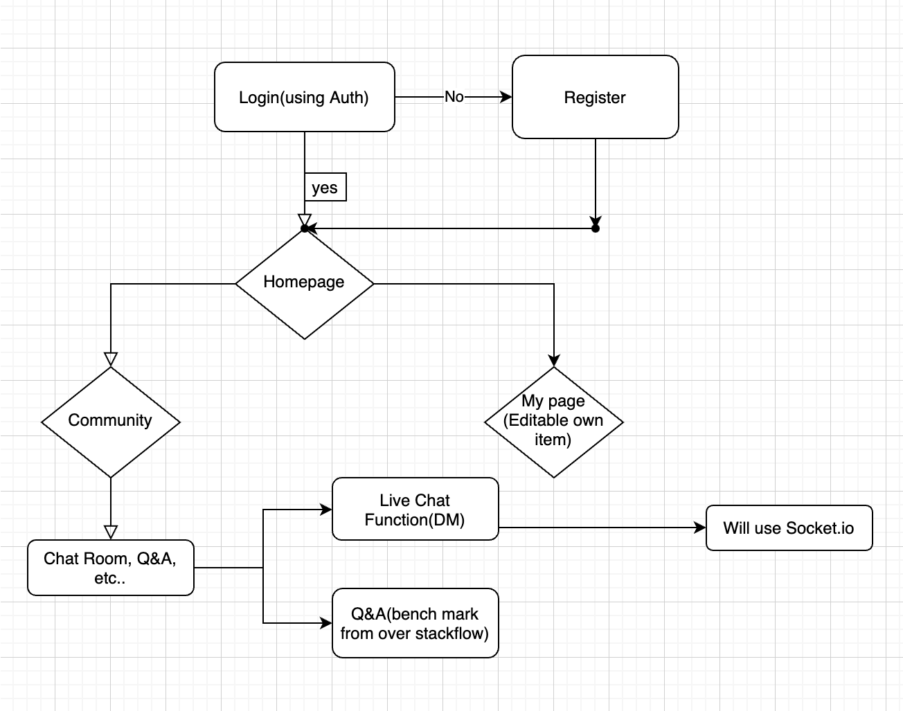

# App Market
General Assembly SEI Capstone Project,

App Market is allows all developers(user) to buy and sell their own apps. There is community where all users can share their knowledge, resources and information. Also each user can make freindships by posting and commenting.

## User Stories
- User should be able to post their selling app.
- User should be able to contact to seller by providing seller's email address.
- User should be able to manage(edit, delete, post) own Apps in MyPage.
- User should be able to coding questions & answers in Community.

## Wireframe



## Technologies
POSTGRESQL || EXPRESS || NODE.JS || REACT || REACT-BOOTSTRAP || bcrypt || jwt || Surge || Heroku

## Installation
Clone this repo
```
$git clone https://github.com/style6513/capstone-codes.git
$npm install
$npm start
```

## Project Goals
- Completing Full CRUD & Auth using postgresql for the first time instead of the always used mongoose.
- Basic CSS, More focus on set up basic Full CRUD in 1 week during project term.

## Future Considerations
- Creating a community where users can communicate with each other.
- Add styling to look more professional.
- Add SOCKET.io for live chat , following user, etc...
- Add OAUTH(Can Login with google acc without register)

## Code Snippets
```
    static async request(endpoint, data = {}, method = "GET") {
        const url = `${BASE_URL}/${endpoint}`;
        const headers = { Authorization: `Bearer ${Api.token}` }
        const params = (method === "GET") ? data : {}

        try {
            return (await axios({ url, method, data, params, headers })).data;
        }
        catch (e) {
            console.log(e)
        }
    }
```
