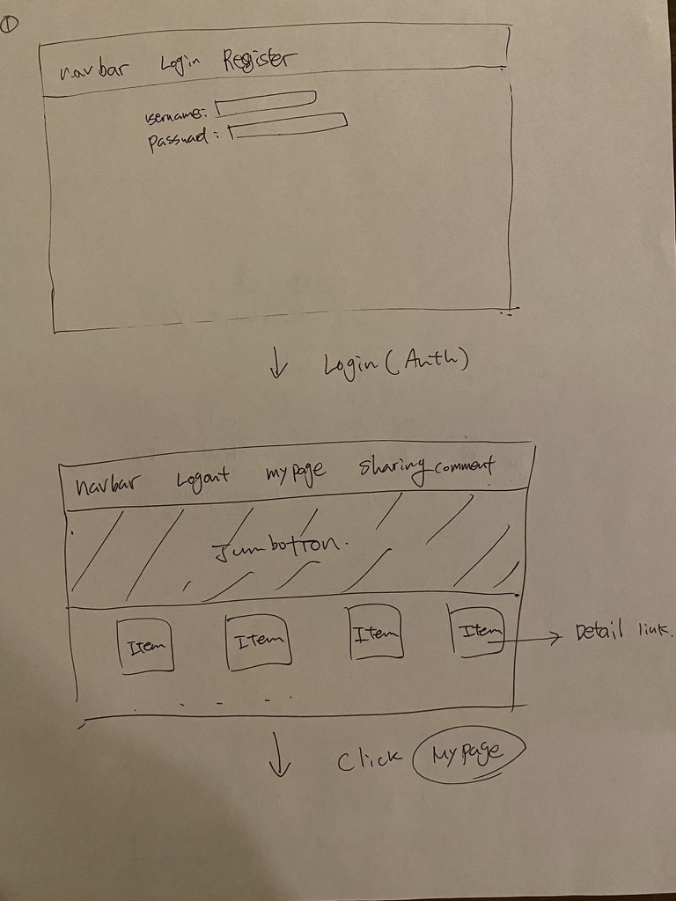

# App Market
General Assembly SEI Capstone Project

App Market is allows all developers(user) to buy and sell their own apps. There is community where all users can share their knowledge, resources and information. Also each user can make freindships by posting and commenting.

# User Stories
- User should be able to post their selling app.
- User should be able to contact to seller by providing seller's email address.
- User should be able to manage(edit, delete, post) own Apps in MyPage.
- User should be able to coding questions & answers in Community.

# Wireframe(By handwriting)

